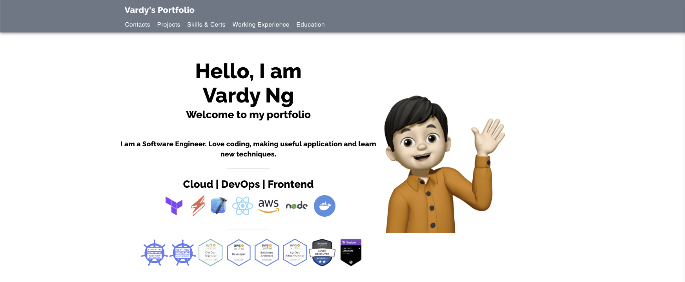

# My Portfolio Website

> Screen Cap updated on 2024-04-29

### What is this?
This is the source code of my Portfolio Website, available at [VardyNg.com](vardyng.com).

It contains all my projects, certs, educations, work history ...etc

Made by ReactJS, hosted on AWS S3 bucket static hosting, use Cloudflare as DNS

The infrastructure repo will be made public soon :)

### What is included?
- ReactJS code for the website
- GitHub Actions for deploying to S3 and [DockerHub ](https://hub.docker.com/r/vardyng/portfolio)
- Jenkins pipeline (deprecated)

### Start the project
Install NodeJS, run `npm install` to install dependencies, then `npm run start` to start it locally!

### Deployment
Refer to the [s3](/.github/workflows/prod-s3-deployment.yml) and [docker](/.github/workflows/prod-docker-deployment.yml) scripts for the detailed implementation